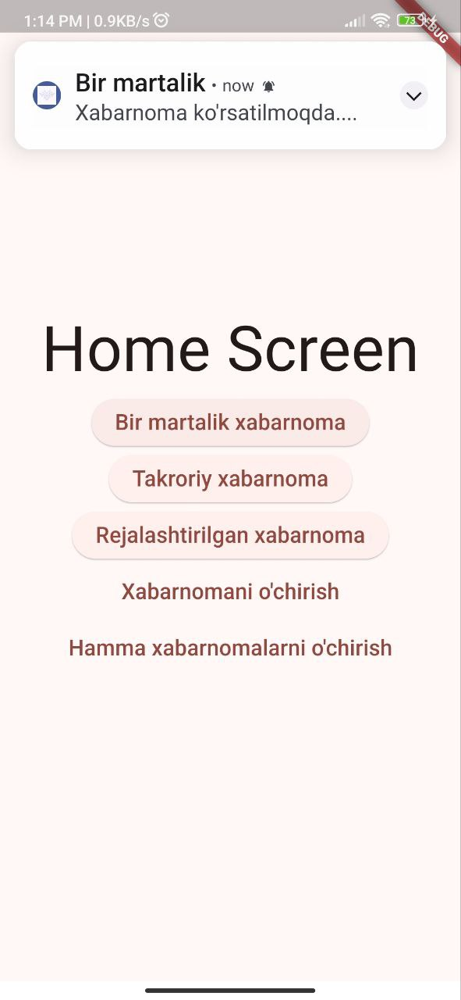
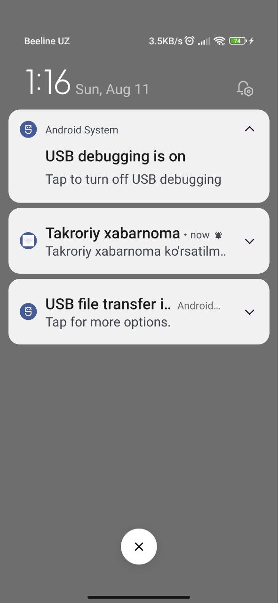
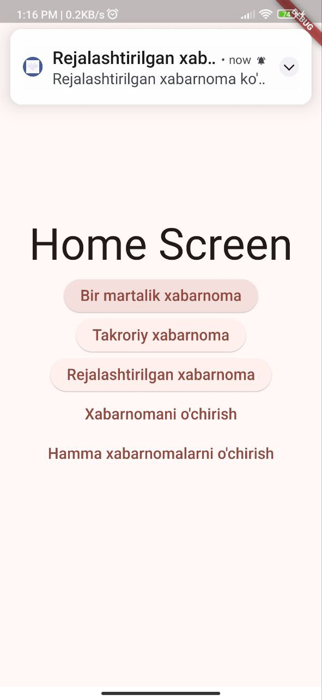
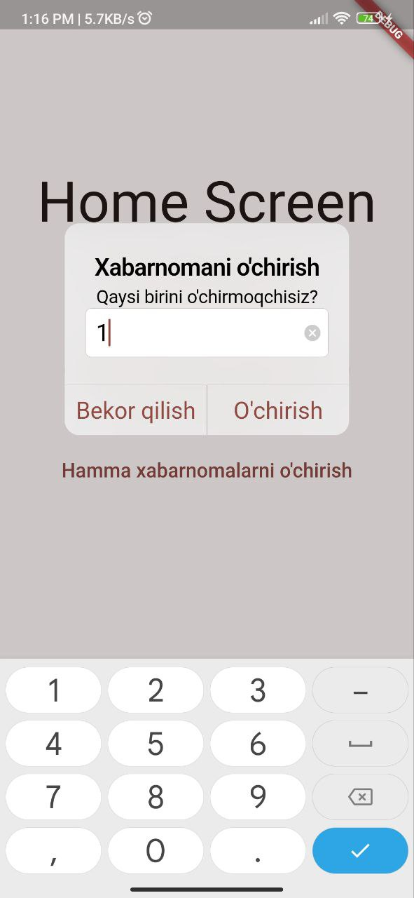

# Local Notifications

A new Flutter project showcasing local notifications.

## Screenshots

Here are some screenshots of the app:

### Bir martalik 



### Takroriy



### Rejalashtirilgan



### Xabarnomani o'chirish



## Getting Started

Ushbu loyiha Flutter dasturi uchun boshlang'ich nuqtadir. Ushbu loyihani boshlash uchun quyidagi qadamlarni bajaring:

1. **Clone the Repository**

   ```sh
   git clone https://github.com/your-username/local_notifications.git

2. **Bog'liqliklarni o'rnating**

    ```sh
    cd local_notifications
    flutter pub get
3. **Loyihani ishga tushiring**
    ```sh
    flutter run


## Hissa Qo'shish

Hissalaringizni kutib qolamiz! Iltimos, quyidagi standart GitHub ish jarayonini bajaring:

1. **Repository-ni fork qiling**
2. **Yangi branch yarating** (`git checkout -b feature-branch`)
3. **O'zgartirishlaringizni commit qiling** (`git commit -am 'Yangi xususiyat qo'shildi'`)
4. **Branch-ga push qiling** (`git push origin feature-branch`)
5. **Yangi Pull Request yarating**
